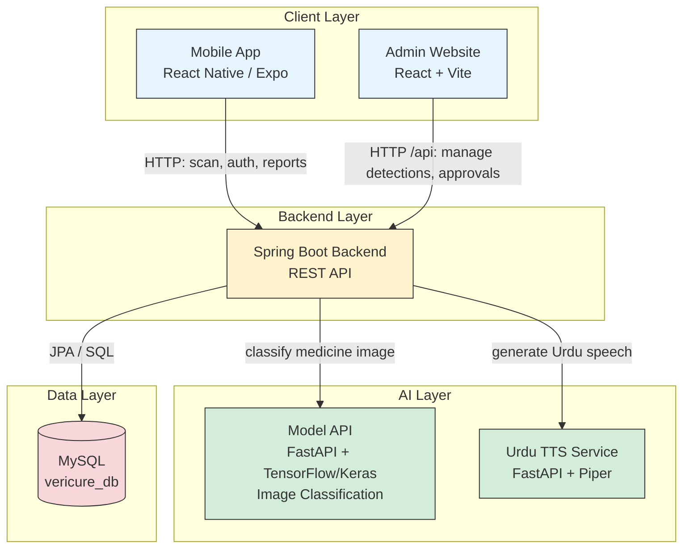

# VeriCure

VeriCure is a counterfeit-medicine detection system. It combines a mobile app
(scan a medicine and get a verdict), a Spring Boot backend, a Python model
API (image classification + Urdu text‑to‑speech), and an admin web
dashboard for reviewing detections and reports.

## Features

**Mobile app**
- Scan a medicine and get an instant authenticity verdict
- Save scan history and revisit past results
- Home medicine cabinet — track medicines you own, with expiry dates
- Report a counterfeit or suspicious medicine
- AI chat assistant for medicine-related questions
- Urdu text-to-speech for scan results and insights
- Account features: register, login, OTP verification, password reset/change

**Admin dashboard**
- Review and approve/reject pending medicine submissions
- Browse all detections and reported medicines
- Manage admin accounts
- Generate reports (PDF export)

## Project structure

```
VeriCure_FYP/
├── mobile-app/VeriCure/        # React Native (Expo) app — end-user app
├── backend/vericure-backend/   # Spring Boot REST API
├── model-api/                  # FastAPI service: image classification model + Urdu TTS
│   └── urdutts/                 # Piper-based Urdu text-to-speech sub-service
├── admin-website/vericure-admin-website/  # React + Vite admin dashboard
└── database - query/           # MySQL schema (vericure_db.sql)
```

### How the pieces talk to each other

- The **mobile app** calls the **backend** over HTTP (`API_BASE_URL` in
  `mobile-app/VeriCure/src/config/api.ts`).
- The **backend** calls the **model API** (`model.api.url` in
  `application.properties`) for medicine image classification, and can be
  configured to auto-start it.
- The **admin website** calls the **backend** through `/api` (proxied in
  dev by Vite, or via `VITE_API_BASE_URL` in production).
- The **backend** stores data in **MySQL** using the schema in
  `database - query/vericure_db.sql`.

---

## Prerequisites

| Component        | Requires                                              |
|-------------------|--------------------------------------------------------|
| backend           | Java 17, Maven (or the bundled `mvnw`), MySQL 8+       |
| model-api         | Python 3.11+, pip                                      |
| admin-website     | Node.js 18+, npm                                       |
| mobile-app        | Node.js 18+, npm, Expo CLI (`npx expo`), Android Studio / Xcode for native builds |

---

## 1. Database setup

1. Start MySQL and create the schema:
   ```bash
   mysql -u root -p < "database - query/vericure_db.sql"
   ```
   This creates the `vericure_db` database and all tables (it's the
   up-to-date, consolidated schema file, safe to run top-to-bottom on an
   empty server).

---

## 2. Model API (FastAPI) — image classification

```bash
cd model-api
python -m venv venv
source venv/bin/activate        # Windows: venv\Scripts\activate
pip install -r requirements.txt
uvicorn main:app --host 0.0.0.0 --port 8001
```

The service loads `VeriCure_Model_v1.0.keras` from this folder — keep the
file next to `main.py`.

### Urdu text-to-speech sub-service (optional)

```bash
cd model-api/urdutts
python -m venv venv
source venv/bin/activate
pip install -r requirements.txt
python urdu_tts_server.py       # serves on port 5001
```

This needs the Piper voice model files already included under
`model-api/urdutts/model/`.

---

## 3. Backend (Spring Boot)

The backend reads all secrets and environment-specific values from
**environment variables** — nothing sensitive is hardcoded in
`application.properties`. Set these before running:

| Variable             | Purpose                                               | Required |
|-----------------------|-------------------------------------------------------|----------|
| `DB_URL`              | JDBC URL, defaults to `jdbc:mysql://localhost:3306/vericure_db` | no |
| `DB_USERNAME`         | MySQL user, defaults to `root`                        | no |
| `DB_PASSWORD`         | MySQL password                                        | yes |
| `MODEL_API_URL`       | URL of the FastAPI model service, defaults to `http://localhost:8001` | no |
| `MODEL_API_AUTO_START`| Auto-start the FastAPI service from Spring Boot, defaults to `true` | no |
| `MODEL_API_PYTHON`    | Python executable name, defaults to `py`              | no |
| `MODEL_API_PATH`      | Absolute path to `model-api/` on your machine          | yes (if auto-start is on) |
| `GEMINI_API_KEY`      | Google Gemini API key (used for chat/insights features)| yes |
| `MAIL_USERNAME`       | Gmail address used to send OTP emails                 | yes |
| `MAIL_PASSWORD`       | Gmail **App Password** (not your account password)    | yes |
| `ADMIN_JWT_SECRET`    | 32+ char secret for signing admin JWTs — set a fixed value before any real deployment | recommended |

Then run:

```bash
cd backend/vericure-backend
./mvnw spring-boot:run          # Windows: mvnw.cmd spring-boot:run
```

---

## 4. Admin website (React + Vite)

```bash
cd admin-website/vericure-admin-website
npm install
npm run dev
```

In dev mode, `/api` requests are proxied to the backend so there are no
CORS issues. For a production build, set `VITE_API_BASE_URL` to the
public backend URL before building:

```bash
VITE_API_BASE_URL=https://your-backend.example.com npm run build
```

---

## 5. Mobile app (React Native / Expo)

```bash
cd mobile-app/VeriCure
npm install
```

Edit **one line** in `src/config/api.ts` and point it at your backend's
LAN IP (your phone and computer must be on the same Wi-Fi network):

```ts
export const API_BASE_URL = 'http://<your-computer-ip>:8080';
```

Find your IP with `ipconfig` (Windows) or `ifconfig | grep inet` (Mac/Linux).
Then start the app:

```bash
npx expo start
```

Scan the QR code with Expo Go, or run `npm run android` / `npm run ios`
for a native build.

---

## Architecture



## Known limitations / notes

- This is a Final Year Project (FYP) build, not a production-hardened
  deployment — review the environment-variable table above before
  deploying anywhere public.
- The model files (`model-api/VeriCure_Model_v1.0.keras`,
  `model-api/urdutts/model/*.onnx`, and
  `mobile-app/VeriCure/assets/*.tflite`) are tens of MB each. If you hit
  GitHub's file-size warnings when pushing, use
  [Git LFS](https://git-lfs.com/) for these three files.

## License

See `mobile-app/VeriCure/LICENSE`.
